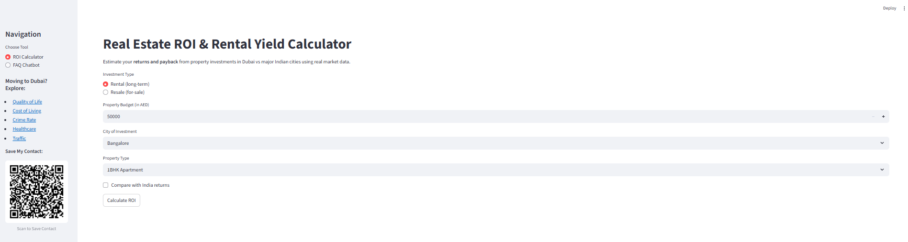
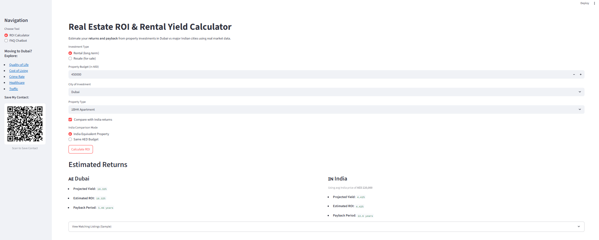
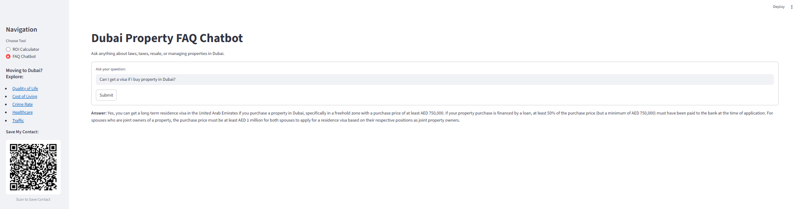
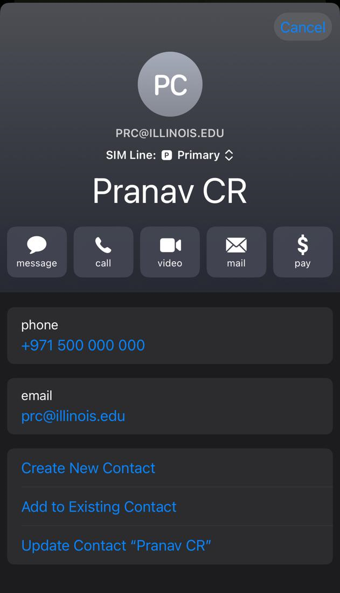

# DxbAgent: Dubai Property Investment and FAQ Assistant

DxbAgent is an interactive Streamlit-based web application that enables users to calculate Return on Investment (ROI) and rental yield for Dubai properties, and interact with an AI-powered chatbot that answers Dubai real estate–related queries. It uses a Retrieval-Augmented Generation (RAG) architecture and Ollama for local LLM inference.

---

## Features

### 1. ROI Calculator
- Calculate ROI, projected rental yield, and payback period for Dubai real estate investments.
- Compare performance with similar Indian properties using real market data.
- Dynamic selection of city, property type, and budget.

### 2. FAQ Chatbot
- Ask natural language questions about Dubai property laws, RERA, tenancy, resale, etc.
- Answers are generated using a local LLM (`mistral`) and LangChain-powered RAG system with PDF documents as context.
- Vector store created using FAISS and MiniLM sentence embeddings.

### 3. Sidebar Tools
- Quality-of-life links for expats moving to Dubai (e.g., crime rate, healthcare, cost of living).
- Downloadable QR contact card for quick agent reach-out.

### 4. Outreach Assistant
- Upload a CSV of leads (name, city, tone, and unique selling point).
- Generate WhatsApp-ready A/B outreach messages using `mistral` via Ollama.
- Supports WhatsApp formatting and message download as CSV.
- Built-in prompt caching to reuse previous generations and reduce load time.

---

## Folder Structure

```bash
DxbAgent/
├── app/
│   ├── chatbot/
│   │   ├── chatbot.py             # RAG pipeline with Ollama + LangChain
│   │   ├── ingest_docs.py         # PDF loader and FAISS vector store
│   │   └── ui.py                  # Streamlit UI for chatbot
│   ├── roi_calculator/
│   │   ├── calculator.py          # ROI computation logic
│   │   ├── bayut_fetcher.py       # (Optional) scraping logic 
│   │   ├── test_bayut.py          # Test runner for scraper 
│   │   └── ui.py                  # Streamlit UI for ROI calculator
│   └── outreach/
│       ├── generator.py           # Outreach message generator
│       └── ui.py                  # Streamlit UI
│
├── data/
│   ├── Circular_Residence-Visas-for-Property-Owners-in-Dubai.pdf
│   ├── real-estate-brokerage-practice-guide.pdf
│   ├── tenancyguideen.pdf
│   └── faq_faiss_index/          # FAISS vectorstore
│
├── screenshots/                  # UI screenshots (for README or docs)
│                 
│
├── main.py                       # Main Streamlit launcher with routing
├── requirements.txt              # Python dependencies
├── sample.csv                    # Sample dataset of property listings
└── README.md                     
```

## Getting Started

### 1. Clone the Repository

```bash
git clone https://github.com/yourusername/DxbAgent.git
cd DxbAgent
```

### 2. Set Up Environment
```bash
python -m venv venv
source venv/bin/activate  # or venv\Scripts\activate on Windows
pip install -r requirements.txt
```

### 3. Pull the LLM Model (via Ollama)
```bash
ollama pull mistral
```

### 4. Start the App
```bash
streamlit run main.py
```


## Outreach Module

The outreach feature is located in `app/outreach/` and includes:

- `generator.py`: LLM-powered template generator using Mistral via Ollama.
- `ui.py`: Streamlit interface to upload CSVs and generate/download A/B outreach messages.
- `qr_code.png`: Default contact QR image for sidebar display.

### Example Input CSV

| name   | city       | tone_a     | tone_b     | usp_a              | usp_b                    |
|--------|------------|------------|------------|--------------------|--------------------------|
| Ramesh | Hyderabad  | friendly   | formal     | high ROI           | tax-free rental income   |
| Aarti  | Mumbai     | persuasive | informative| low entry price    | booming expat demand     |

### Output

- WhatsApp-formatted messages with placeholders replaced.
- Download button to get `ab_test_outreach_messages.csv`.

To launch:

```bash
streamlit run app/outreach/ui.py
```

## Results

### ROI Calculator
> Input screen where users can select budget, city, and property type to analyze potential returns.



---

### ROI Calculator with India Comparison
> After hitting "Calculate ROI", the app compares projected returns in Dubai with those in major Indian cities.



---

### FAQ Chatbot
> Chatbot interface for querying property laws, RERA, taxes, resale eligibility, and more using a local LLM.



---

### Sidebar Contact Card
> QR code for saving agent contact (Pranav CR) quickly via smartphone. Shared across all modules.




